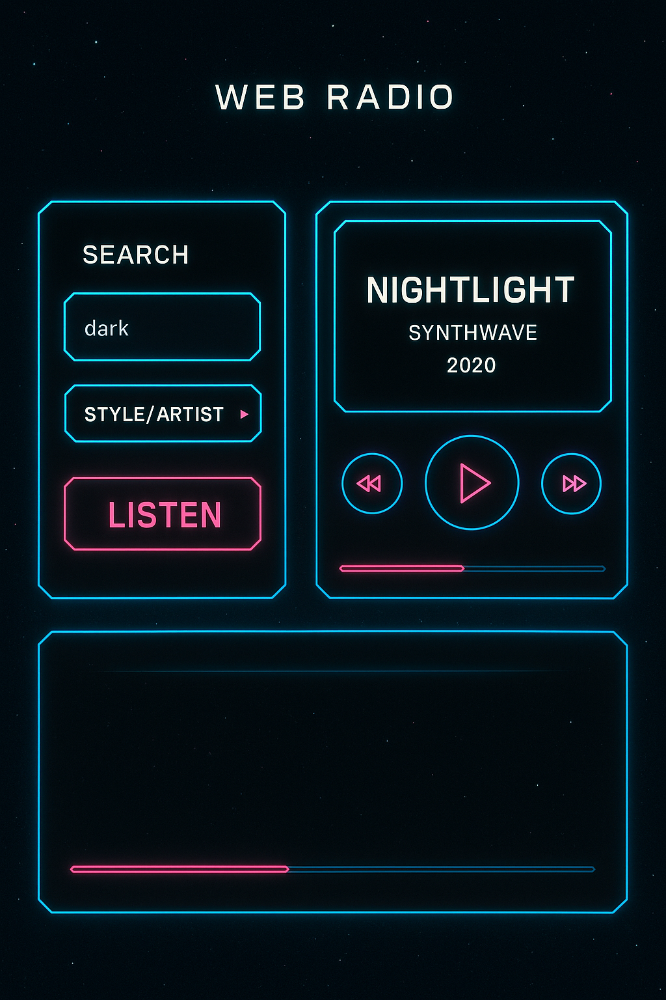

# Radio Application

A web-based radio application that streams music from OneTwo.tv. Search and play tracks by style/genre or artist name.

## Project Description

This is a web-based radio application that allows users to search and play music by style/genre and artist name. The application scrapes music tracks from the OneTwo.tv website and provides a streaming radio experience.



### Architecture
- **Frontend**: Angular 5.0 application with Bootstrap UI framework
- **Backend**: Spring Boot 2.0 REST API with Spring Security
- **Data Source**: Web scraping from OneTwo.tv using Jsoup library

### Key Features
- Music search by style/genre
- Music search by artist name
- Web-based music player with streaming capabilities
- Responsive UI built with Bootstrap
- RESTful API endpoints for track retrieval

## Quick Start

### Prerequisites
- Java 8+
- Node.js 8+
- Angular CLI

### Backend Setup
```bash
cd service
./gradlew bootRun
```

### Frontend Setup
```bash
cd client
npm install
ng serve
```

### Build for Production
```bash
# Build frontend
cd client
ng build --prod

# Build backend
cd service
./gradlew build
```

## Data Source

Music tracks are scraped from [OneTwo.tv](https://onetwo.tv/) using Jsoup library.

## License

This project is licensed under the GNU General Public License v3.0 (GPL-3.0).

### GPL-3.0 License Summary

This program is free software: you can redistribute it and/or modify it under the terms of the GNU General Public License as published by the Free Software Foundation, either version 3 of the License, or (at your option) any later version.

This program is distributed in the hope that it will be useful, but WITHOUT ANY WARRANTY; without even the implied warranty of MERCHANTABILITY or FITNESS FOR A PARTICULAR PURPOSE. See the GNU General Public License for more details.

You should have received a copy of the GNU General Public License along with this program. If not, see [https://www.gnu.org/licenses/](https://www.gnu.org/licenses/).

